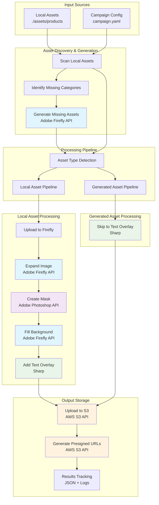
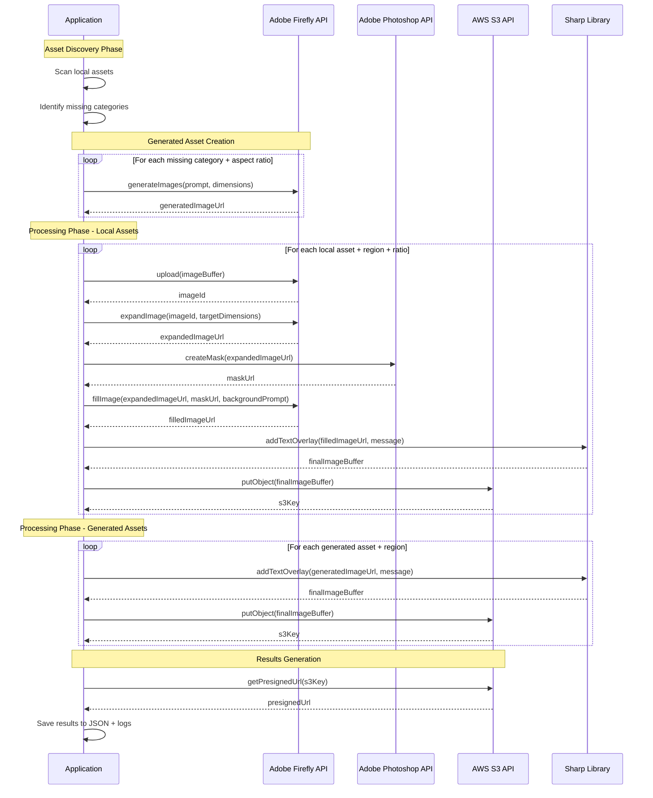

# Creative Automation POC

## Overview
Proof of concept for automated creative asset localization using Adobe Firefly APIs and AWS S3. This project demonstrates automated image generation, background replacement, and text overlay capabilities for multi-regional marketing campaigns.

## Features

### 🤖 **Automated Image Processing**
- **Asset Generation**: AI-powered creation of missing product images using Firefly
- **Multi-Aspect Ratio Support**: Generate assets in 1:1 (square), 9:16 (portrait), and 16:9 (landscape) formats
- **Firefly-Optimized Dimensions**: Uses Adobe Firefly supported sizes (2048×2048, 1792×2304, 2688×1512)
- **Image Expansion**: Resize assets to different aspect ratios
- **Background Replacement**: AI-powered background generation with region-specific prompts
- **Text Overlay**: Dynamic text placement with Sharp library
- **Multi-Format Support**: PNG, JPEG, WebP

### 🌍 **Multi-Regional Localization**
- **Region-Specific Content**: Different messages and backgrounds per region
- **Product Category Support**: Fragrances, shoes, clothing, accessories, etc.
- **Campaign Management**: YAML-based configuration system with product prompts
- **Intelligent Asset Management**: Automatic generation for missing product categories

### 📊 **Results & Monitoring**
- **Success/Failure Tracking**: Detailed results for each processed image
- **Presigned URLs**: Direct access to generated assets
- **Comprehensive Logging**: File-based logs with rotation
- **JSON Reports**: Structured output for integration

### ☁️ **Cloud Integration**
- **AWS S3**: Automated storage with organized folder structure
- **Adobe Firefly**: AI image generation and manipulation
- **Adobe Photoshop**: Advanced masking and compositing

## Quick Start

### Prerequisites
- Node.js ≥ 20
- Adobe Firefly API credentials
- AWS S3 credentials

### Installation
```bash
npm install
```

### Configuration
Create `.env` file:
```bash
# Adobe Firefly API
ADOBE_CLIENT_ID=your_client_id
ADOBE_CLIENT_SECRET=your_client_secret
ADOBE_SCOPES=openid,AdobeID,firefly_api,ff_apis

# AWS S3
AWS_REGION=us-east-1
AWS_ACCESS_KEY_ID=your_access_key
AWS_SECRET_ACCESS_KEY=your_secret_key
S3_BUCKET_NAME=your_bucket_name
S3_KEY_PREFIX=creative_automation_poc
```

### Campaign Configuration
Edit `campaign.yaml`:
```yaml
campaign:
  id: "creative_automative_poc_2025"
  name: "Bold Steps, Signature Scents"
  assets_folder: "./assets/products"
  aspect_ratios: ["1:1", "9:16", "16:9"]
  
  product_categories:
    fragrances:
      target_regions:
        - code: "US"
          locale: "en-US"
          audience: "young professionals"
          message: "Captivate Your Essence"
          background_prompt: "elegant modern perfumery"
    shoes:
      target_regions:
        - code: "US"
          locale: "en-US"
          audience: "active lifestyle enthusiasts"
          message: "Step Into Confidence"
          background_prompt: "urban streetwear environment"
          
  product_prompts:
    fragrances: "A luxury perfume bottle with elegant design, crystal clear glass, golden cap, sitting on a white marble surface with soft studio lighting, premium product photography style, high quality, commercial photography"
    shoes: "A premium athletic sneaker, modern design, clean white and accent colors, side view on white background, studio lighting, product photography style, high quality, commercial photography"
    clothing: "A premium fashion item, modern style, clean design on white background, studio lighting, product photography style, high quality, commercial photography"
    accessories: "A luxury accessory item, premium materials, elegant design on white background, studio lighting, product photography style, high quality, commercial photography"
```

### Run
```bash
npm start
```

## Project Structure
```
creative_automative_poc/
├── assets/
│   └── products/          # Source images by category
├── logs/                  # Application logs
├── results-YYYY-MM-DD.json # Processing results
├── index.js              # Main application
├── firefly-utils.js       # Adobe API utilities
├── S3Client.js           # AWS S3 integration
├── logger.js             # Logging system
├── campaign.yaml         # Campaign configuration
└── .env                  # Environment variables
```

## Output Structure
Generated assets are organized in S3:
```
s3://bucket/creative_automation_poc/
├── intermediate/                    # Generated assets (temporary)
│   └── category_generated_ratio.jpg
└── campaign_id/                    # Final processed assets
    └── product_category/
        └── region/
            └── aspect_ratio/
                └── filename_region_ratio_timestamp.ext
```

### Asset Types
- **Local Assets**: Existing images processed through full pipeline (expand → mask → fill → text overlay)
  - Processed for all configured aspect ratios
  - Can be any initial size or format
- **Generated Assets**: AI-created images for missing categories (text overlay only)
  - Generated at Firefly-optimized dimensions for each aspect ratio
  - Only processed for their specific aspect ratio to maintain quality
  - Skip expand/mask/fill pipeline for efficiency

## Architecture & Workflow

### System Design Overview

> **Note**: If the Mermaid diagrams below don't render in your Markdown preview, the visual diagrams are available in the development environment.



### API Integration Details



### Text-Based Workflow Summary

**Phase 1: Asset Discovery**
1. Scan `./assets/products` for existing images
2. Parse `campaign.yaml` for configuration
3. Identify missing product categories
4. Generate missing assets via Adobe Firefly API

**Phase 2: Processing Pipeline**

*Local Assets (Full Pipeline):*
1. **Upload** → Adobe Firefly API
2. **Expand** → Adobe Firefly API (resize to target dimensions)
3. **Mask** → Adobe Photoshop API (create subject mask)
4. **Fill** → Adobe Firefly API (replace background)
5. **Text Overlay** → Sharp Library (add localized text)
6. **Upload** → AWS S3 (final storage)

*Generated Assets (Streamlined):*
1. **Text Overlay** → Sharp Library (add localized text)
2. **Upload** → AWS S3 (final storage)

**Phase 3: Results & Tracking**
1. Generate presigned URLs for easy access
2. Save detailed results to JSON file
3. Log all operations with timestamps
4. Track success/failure rates per region/ratio

## Key Technologies
- **Adobe Firefly API**: AI image generation and manipulation
- **Adobe Photoshop API**: Advanced image editing capabilities
- **Sharp**: High-performance image processing
- **AWS S3**: Cloud storage with presigned URLs
- **Node.js**: Runtime environment

## Documentation
- [📋 Logging System](./LOGGING.md)
- [📊 Results Tracking](./RESULTS.md)

## Use Cases
- **Marketing Campaigns**: Automated asset localization
- **E-commerce**: Product image variations
- **Brand Management**: Consistent regional messaging
- **Content Creation**: Scalable creative workflows

## License
Proof of concept project for demonstration purposes.
